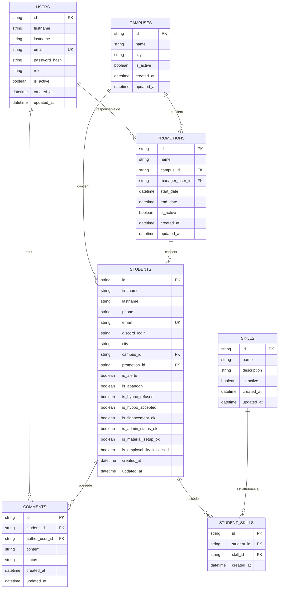

# Modèle de données

## Vue d'ensemble

Le CRM utilise 7 tables principales :

```text
users
campuses
promotions
students
skills
student_skills
comments
```

## Relations



## Identifiants

Le projet utilise Prisma avec SQLite.

Les identifiants peuvent être générés par Prisma avec `uuid()`.

Exemple :

```prisma
id String @id @default(uuid())
```

## Contraintes importantes

### Email utilisateur

```text
users.email UNIQUE
```

### Email apprenant

```text
students.email UNIQUE
```

Un email vide doit être géré comme `null` et non comme une chaîne vide afin de permettre plusieurs apprenants sans email.

### Compétence d'un apprenant

Une même compétence ne peut être attribuée qu'une fois au même apprenant.

```text
UNIQUE(student_id, skill_id)
```

### Hippocamp

Les deux indicateurs suivants ne doivent jamais être vrais simultanément :

```text
is_hyppo_refused
is_hyppo_accepted
```

Cette règle doit être contrôlée par l'application.

SQLite et Prisma ne nécessitent pas ici de complexifier le schéma avec une logique spécifique si la validation applicative est suffisante.

## Suppression

Par défaut :

- utilisateurs : désactivation via `is_active` ;
- campus : désactivation via `is_active` ;
- promotions : désactivation via `is_active` ;
- compétences : désactivation via `is_active`.

Pour les apprenants et commentaires, une suppression réelle peut être proposée si elle ne casse pas l'intégrité des données.

Ne pas ajouter de système générique de soft delete tant qu'il n'est pas nécessaire.
